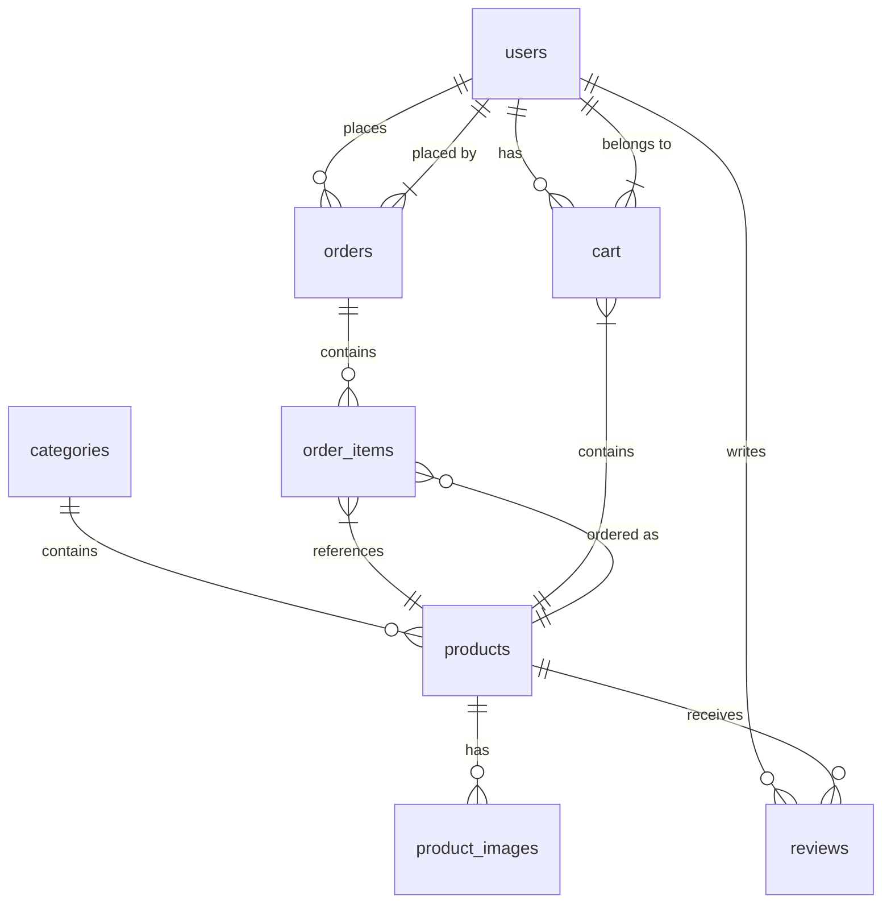

# E-commerce Database Documentation

## Overview

This document describes the database schema for the e-commerce application. The database is designed to handle products, users, orders, and reviews in a normalized structure.

## Database Schema

### Visual Representation (Mermaid.js)



## Database Schema Details

### Table Creation Queries

#### 1. Categories Table
```sql
CREATE TABLE categories (
    category_id SERIAL PRIMARY KEY,
    name VARCHAR(100) NOT NULL,
    description TEXT,
    image_url VARCHAR(255),
    created_at TIMESTAMP WITH TIME ZONE DEFAULT CURRENT_TIMESTAMP,
    updated_at TIMESTAMP WITH TIME ZONE DEFAULT CURRENT_TIMESTAMP
);
```
**Foreign Keys:** None (Parent table)
**Referenced By:** 
- `products.category_id`

#### 2. Users Table
```sql
CREATE TABLE users (
    user_id SERIAL PRIMARY KEY,
    username VARCHAR(50) UNIQUE NOT NULL,
    email VARCHAR(100) UNIQUE NOT NULL,
    password_hash VARCHAR(255) NOT NULL,
    full_name VARCHAR(100),
    shipping_address TEXT,
    phone_number VARCHAR(20),
    is_admin BOOLEAN DEFAULT FALSE,
    email_verified BOOLEAN DEFAULT FALSE,
    created_at TIMESTAMP WITH TIME ZONE DEFAULT CURRENT_TIMESTAMP,
    last_login TIMESTAMP WITH TIME ZONE
);
```
**Foreign Keys:** None (Parent table)
**Referenced By:**
- `orders.user_id`
- `reviews.user_id`
- `cart.user_id`

#### 3. Products Table
```sql
CREATE TABLE products (
    product_id SERIAL PRIMARY KEY,
    category_id INTEGER REFERENCES categories(category_id) ON DELETE SET NULL,
    name VARCHAR(200) NOT NULL,
    description TEXT,
    price DECIMAL(10, 2) NOT NULL,
    stock_quantity INTEGER NOT NULL DEFAULT 0,
    image_url VARCHAR(255),
    is_active BOOLEAN DEFAULT TRUE,
    discount_price DECIMAL(10, 2),
    created_at TIMESTAMP WITH TIME ZONE DEFAULT CURRENT_TIMESTAMP,
    updated_at TIMESTAMP WITH TIME ZONE DEFAULT CURRENT_TIMESTAMP
);
```
**Foreign Keys:**
- `category_id` → `categories(category_id)`
**Referenced By:**
- `product_images.product_id`
- `order_items.product_id`
- `reviews.product_id`
- `cart.product_id`

#### 4. Product Images Table
```sql
CREATE TABLE product_images (
    image_id SERIAL PRIMARY KEY,
    product_id INTEGER REFERENCES products(product_id) ON DELETE CASCADE,
    image_url VARCHAR(255) NOT NULL,
    is_primary BOOLEAN DEFAULT FALSE,
    created_at TIMESTAMP WITH TIME ZONE DEFAULT CURRENT_TIMESTAMP
);
```
**Foreign Keys:**
- `product_id` → `products(product_id)`
**Referenced By:** None (Child table)

#### 5. Orders Table
```sql
CREATE TABLE orders (
    order_id SERIAL PRIMARY KEY,
    user_id INTEGER REFERENCES users(user_id) ON DELETE SET NULL,
    order_date TIMESTAMP WITH TIME ZONE DEFAULT CURRENT_TIMESTAMP,
    total_amount DECIMAL(10, 2) NOT NULL,
    status VARCHAR(20) DEFAULT 'pending' 
        CHECK (status IN ('pending', 'processing', 'shipped', 'delivered', 'cancelled')),
    shipping_address TEXT NOT NULL,
    payment_status VARCHAR(20) DEFAULT 'pending' 
        CHECK (payment_status IN ('pending', 'paid', 'failed', 'refunded')),
    payment_method VARCHAR(50),
    tracking_number VARCHAR(100),
    notes TEXT,
    updated_at TIMESTAMP WITH TIME ZONE DEFAULT CURRENT_TIMESTAMP
);
```
**Foreign Keys:**
- `user_id` → `users(user_id)`
**Referenced By:**
- `order_items.order_id`

#### 6. Order Items Table
```sql
CREATE TABLE order_items (
    order_item_id SERIAL PRIMARY KEY,
    order_id INTEGER REFERENCES orders(order_id) ON DELETE CASCADE,
    product_id INTEGER REFERENCES products(product_id) ON DELETE SET NULL,
    quantity INTEGER NOT NULL CHECK (quantity > 0),
    unit_price DECIMAL(10, 2) NOT NULL,
    created_at TIMESTAMP WITH TIME ZONE DEFAULT CURRENT_TIMESTAMP
);
```
**Foreign Keys:**
- `order_id` → `orders(order_id)`
- `product_id` → `products(product_id)`
**Referenced By:** None (Child table)

#### 7. Reviews Table
```sql
CREATE TABLE reviews (
    review_id SERIAL PRIMARY KEY,
    product_id INTEGER REFERENCES products(product_id) ON DELETE CASCADE,
    user_id INTEGER REFERENCES users(user_id) ON DELETE CASCADE,
    rating SMALLINT NOT NULL CHECK (rating BETWEEN 1 AND 5),
    comment TEXT,
    created_at TIMESTAMP WITH TIME ZONE DEFAULT CURRENT_TIMESTAMP,
    updated_at TIMESTAMP WITH TIME ZONE DEFAULT CURRENT_TIMESTAMP,
    UNIQUE(product_id, user_id)
);
```
**Foreign Keys:**
- `product_id` → `products(product_id)`
- `user_id` → `users(user_id)`
**Referenced By:** None (Child table)

#### 8. Cart Table
```sql
CREATE TABLE cart (
    cart_item_id SERIAL PRIMARY KEY,
    user_id INTEGER REFERENCES users(user_id) ON DELETE CASCADE,
    product_id INTEGER REFERENCES products(product_id) ON DELETE CASCADE,
    quantity INTEGER NOT NULL CHECK (quantity > 0),
    added_at TIMESTAMP WITH TIME ZONE DEFAULT CURRENT_TIMESTAMP,
    UNIQUE(user_id, product_id)
);
```
**Foreign Keys:**
- `user_id` → `users(user_id)`
- `product_id` → `products(product_id)`
**Referenced By:** None (Child table)

## Hierarchical Categories Implementation

### Schema Modification for Hierarchical Categories

To implement subcategories, we added a self-referencing `parent_id` to the categories table:

```sql
-- Add parent_id column to support hierarchical categories
ALTER TABLE categories ADD COLUMN parent_id INTEGER REFERENCES categories(category_id);
```

### Sample Category Structure

```
Main Categories:
├── Apparel
│   ├── Men's Clothing
│   ├── Women's Clothing
│   ├── Kids' Clothing
│   ├── Footwear
│   └── Accessories
├── Electronics

## Sample Products and Image Structure

### Product Catalog

The database includes sample products across different categories with various image formats:

| Product | Category | Price | Stock | Image Format |
|---------|----------|-------|-------|--------------|
| iPhone 14 Pro | Smartphones & Accessories | $999.00 | 87 | JPG |
| MacBook Pro 14" M2 | Laptops & Computers | $1,999.00 | 42 | JPG |
| Premium Cotton T-Shirt | Men's Clothing | $29.99 | 156 | JPG/JPEG |
| The Midnight Library | Fiction Books | $15.99 | 231 | AVIF |
| Vitamin C Brightening Serum | Skincare | $34.99 | 78 | WebP/JPG |

### Image Structure

Product images are organized in the following structure:

```
client/public/images/products/
├── {product_id}/
│   ├── 1.{ext}    (primary image, required)
│   ├── 2.{ext}    (secondary image, optional)
│   ├── 3.{ext}    (additional images, optional)
│   ├── 4.{ext}    (additional images, optional)
│   └── 5.{ext}    (additional images, optional)
```

**Supported Image Formats:**
- JPG/JPEG (`.jpg`, `.jpeg`)
- WebP (`.webp`)
- AVIF (`.avif`)
- PNG (`.png`)

### Example Queries

#### Get Product with Primary Image
```sql
SELECT 
    p.product_id,
    p.name,
    p.price,
    p.stock_quantity,
    c.name as category,
    pi.image_url as main_image
FROM 
    products p
JOIN 
    categories c ON p.category_id = c.category_id
JOIN 
    product_images pi ON p.product_id = pi.product_id AND pi.is_primary = true;
```

#### Get All Images for a Product
```sql
SELECT 
    p.name as product_name,
    pi.image_url,
    pi.is_primary
FROM 
    product_images pi
JOIN 
    products p ON pi.product_id = p.product_id
WHERE 
    p.product_id = 1
ORDER BY 
    pi.is_primary DESC;
```

### Notes
- The first image (1.{ext}) is always considered the primary image
- Additional images (2-5) are shown as thumbnails or in a gallery
- All images are stored in the `client/public/images/products/` directory
- Image paths in the database should use forward slashes (/) for cross-platform compatibility
│   ├── Smartphones & Accessories
│   ├── Laptops & Computers
│   ├── Audio & Headphones
│   ├── Wearable Technology
│   └── Smart Home Devices
└── ... (other main categories)
```

### Querying Hierarchical Data

1. **Get all main categories (no parent):**
   ```sql
   SELECT * FROM categories WHERE parent_id IS NULL ORDER BY name;
   ```

2. **Get subcategories of a specific category:**
   ```sql
   SELECT * FROM categories 
   WHERE parent_id = (SELECT category_id FROM categories WHERE name = 'Electronics')
   ORDER BY name;
   ```

3. **Get full category path for a subcategory:**
   ```sql
   WITH RECURSIVE category_path AS (
       SELECT category_id, name, parent_id, name as path
       FROM categories
       WHERE name = 'Smartphones & Accessories'
       
       UNION ALL
       
       SELECT c.category_id, c.name, c.parent_id, 
              cp.path || ' > ' || c.name
       FROM categories c
       JOIN category_path cp ON c.category_id = cp.parent_id
   )
   SELECT path FROM category_path WHERE parent_id IS NULL;
   ```

4. **Get all products in a category and its subcategories:**
   ```sql
   WITH RECURSIVE category_tree AS (
       -- Start with the parent category
       SELECT category_id, name, parent_id
       FROM categories
       WHERE name = 'Electronics'
       
       UNION ALL
       
       -- Get all children
       SELECT c.category_id, c.name, c.parent_id
       FROM categories c
       JOIN category_tree ct ON c.parent_id = ct.category_id
   )
   SELECT p.*
   FROM products p
   JOIN category_tree ct ON p.category_id = ct.category_id;
   ```

## Table Descriptions

### 1. categories

Stores product categories for organizing the catalog.

- `category_id`: Unique identifier (Primary Key)
- `name`: Category name
- `description`: Detailed description
- `image_url`: Category image
- `created_at`, `updated_at`: Timestamps

### 2. users

Stores user account information.

- `user_id`: Unique identifier (Primary Key)
- `username`, `email`: User credentials
- `password_hash`: Hashed password
- `shipping_address`: Default shipping address
- `is_admin`: Admin flag
- `email_verified`: Email verification status

### 3. products

Stores product information.

- `product_id`: Unique identifier (Primary Key)
- `category_id`: References categories.category_id
- `name`, `description`: Product details
- `price`, `discount_price`: Pricing
- `stock_quantity`: Available inventory
- `is_active`: Product status

### 4. product_images

Stores multiple images per product.

- `image_id`: Unique identifier (Primary Key)
- `product_id`: References products.product_id
- `image_url`: Image path/URL
- `is_primary`: Flag for main product image

### 5. orders

Stores order headers.

- `order_id`: Unique identifier (Primary Key)
- `user_id`: References users.user_id
- `status`: Order status (pending/processing/etc.)
- `total_amount`: Order total
- `payment_status`: Payment status
- `tracking_number`: Shipping tracking

### 6. order_items

Stores individual items within orders.

- `order_item_id`: Unique identifier (Primary Key)
- `order_id`: References orders.order_id
- `product_id`: References products.product_id
- `quantity`: Number of items
- `unit_price`: Price at time of order

### 7. reviews

Stores product reviews.

- `review_id`: Unique identifier (Primary Key)
- `product_id`: References products.product_id
- `user_id`: References users.user_id
- `rating`: Rating (1-5)
- `comment`: Review text

### 8. cart

Stores shopping cart items.

- `cart_item_id`: Unique identifier (Primary Key)
- `user_id`: References users.user_id
- `product_id`: References products.product_id
- `quantity`: Number of items

## Key Relationships

1. **Users to Orders**: One-to-Many

   - A user can place multiple orders
   - Each order belongs to exactly one user

2. **Products to Categories**: Many-to-One

   - Each product belongs to one category
   - A category can have many products

3. **Orders to Order Items**: One-to-Many

   - An order contains multiple order items
   - Each order item belongs to exactly one order

4. **Products to Reviews**: One-to-Many

   - A product can have many reviews
   - Each review is for exactly one product

5. **Users to Cart Items**: One-to-Many
   - A user can have multiple items in their cart
   - Each cart item belongs to exactly one user

## Common Queries

### User Management

**1. Create a new user**

```sql
INSERT INTO users (username, email, password_hash, full_name)
VALUES ('barath', 'barathg.work@gmail.com', 'hashed_password', 'BARATH G')
RETURNING user_id, username, email;
```

**2. Get user by email (for login)**

```sql
SELECT user_id, username, email, password_hash, is_admin
FROM users
WHERE email = 'barathg.work@gmail.com';
```

**3. Update user profile**

```sql
UPDATE users
SET full_name = 'BARATH G',
    shipping_address = '123 Main St',
    phone_number = '123-456-7890',
    updated_at = CURRENT_TIMESTAMP
WHERE user_id = 1
RETURNING *;
```

### Product Management

**1. Get all active products with categories**

```sql
SELECT p.product_id, p.name, p.description, p.price,
       p.discount_price, p.stock_quantity, c.name as category_name,
       pi.image_url as main_image
FROM products p
JOIN categories c ON p.category_id = c.category_id
LEFT JOIN product_images pi ON p.product_id = pi.product_id AND pi.is_primary = true
WHERE p.is_active = true
ORDER BY p.created_at DESC;
```

**2. Get products by category**

```sql
SELECT p.*, c.name as category_name
FROM products p
JOIN categories c ON p.category_id = c.category_id
WHERE p.category_id = :category_id AND p.is_active = true;
```

**3. Search products**

```sql
SELECT p.*, c.name as category_name
FROM products p
JOIN categories c ON p.category_id = c.category_id
WHERE p.name ILIKE '%search_term%'
   OR p.description ILIKE '%search_term%';
```

### Shopping Cart Operations

**1. Add item to cart**

```sql
INSERT INTO cart (user_id, product_id, quantity)
VALUES (1, 5, 1)
ON CONFLICT (user_id, product_id)
DO UPDATE SET quantity = cart.quantity + EXCLUDED.quantity
RETURNING *;
```

**2. Get user's cart with product details**

```sql
SELECT c.cart_item_id, c.quantity,
       p.product_id, p.name, p.price,
       COALESCE(p.discount_price, p.price) as final_price,
       pi.image_url
FROM cart c
JOIN products p ON c.product_id = p.product_id
LEFT JOIN product_images pi ON p.product_id = pi.product_id AND pi.is_primary = true
WHERE c.user_id = 1;
```

**3. Update cart item quantity**

```sql
UPDATE cart
SET quantity = 2
WHERE cart_item_id = 1 AND user_id = 1
RETURNING *;
```

### Order Processing

**1. Create a new order**

```sql
WITH new_order AS (
    INSERT INTO orders (user_id, total_amount, status, shipping_address, payment_status)
    VALUES (1, 199.99, 'pending', '123 Main St', 'pending')
    RETURNING order_id, user_id
),
order_items AS (
    INSERT INTO order_items (order_id, product_id, quantity, unit_price)
    SELECT no.order_id, c.product_id, c.quantity,
           COALESCE(p.discount_price, p.price) as unit_price
    FROM cart c
    JOIN products p ON c.product_id = p.product_id
    CROSS JOIN new_order no
    WHERE c.user_id = no.user_id
    RETURNING order_id, product_id, quantity, unit_price
)
DELETE FROM cart WHERE user_id = 1
RETURNING *;
```

**2. Get order details**

```sql
SELECT o.order_id, o.order_date, o.status, o.total_amount, o.payment_status,
       oi.order_item_id, oi.quantity, oi.unit_price,
       p.name as product_name, p.product_id
FROM orders o
JOIN order_items oi ON o.order_id = oi.order_id
JOIN products p ON oi.product_id = p.product_id
WHERE o.user_id = 1
ORDER BY o.order_date DESC;
```

### Review Management

**1. Add a review**

```sql
INSERT INTO reviews (product_id, user_id, rating, comment)
VALUES (5, 1, 5, 'Great product!')
ON CONFLICT (product_id, user_id)
DO UPDATE SET
    rating = EXCLUDED.rating,
    comment = EXCLUDED.comment,
    updated_at = CURRENT_TIMESTAMP
RETURNING *;
```

**2. Get product reviews with user info**

```sql
SELECT r.rating, r.comment, r.created_at,
       u.username, u.user_id
FROM reviews r
JOIN users u ON r.user_id = u.user_id
WHERE r.product_id = 5
ORDER BY r.created_at DESC;
```

### Admin Queries

**1. Get sales report**

```sql
SELECT
    DATE_TRUNC('day', order_date) as order_day,
    COUNT(DISTINCT order_id) as total_orders,
    SUM(total_amount) as total_revenue,
    AVG(total_amount) as avg_order_value
FROM orders
WHERE status != 'cancelled'
GROUP BY DATE_TRUNC('day', order_date)
ORDER BY order_day DESC;
```

**2. Get low stock products**

```sql
SELECT p.product_id, p.name, p.stock_quantity, c.name as category
FROM products p
JOIN categories c ON p.category_id = c.category_id
WHERE p.stock_quantity < 10 AND p.is_active = true
ORDER BY p.stock_quantity ASC;
```

## Setup Instructions

1. Create the database:

   ```bash
   createdb ecommerce_db
   ```

2. Run the SQL schema file:
   ```bash
   psql -d ecommerce_db -f schema.sql
   ```

## Indexes

The following indexes have been created for performance:

- Products by category
- Orders by user
- Order items by order and product
- Reviews by product
- Cart items by user
